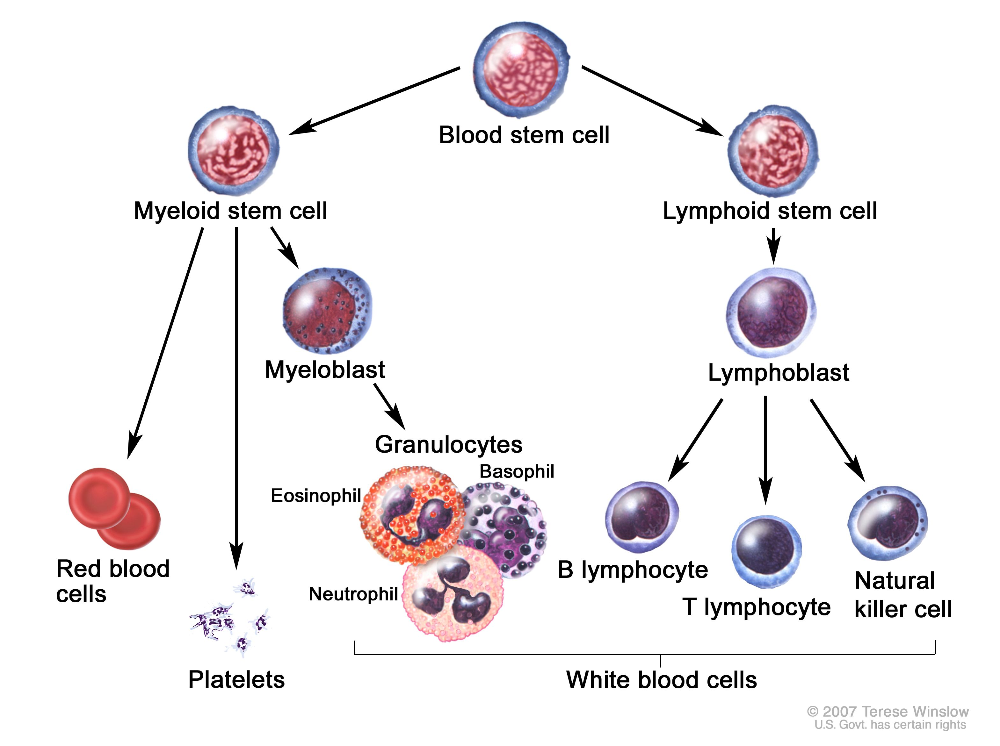
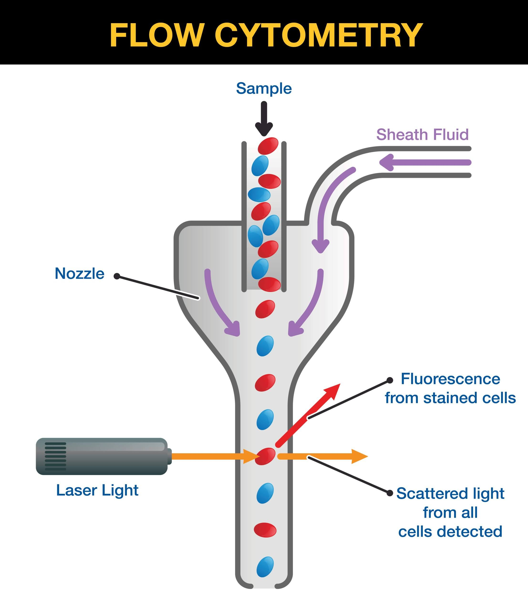

# Visualizing a flow cytometry white blood cell analysis with LightningChart 
## Introduction
**White blood cells** are a part of a body's immune system. These cells are made in bone marrow and also found in blood.

The main part of analyzing white cells is checking their number and types. Different types of cells play different roles in immune systems. For example, basophils deal with allergies and T cells are activated after vaccinations. \
That is why it is important to perform white blood cell analysis, it can help to determine the ability of an organism to deal with different diseases. 
### What is a flow cytometry chart
Flow cytometry is a lab test characteristics of cells and other particles. We won't delve into the process a lot as our main focus is visualizing and analyzing white blood cell flow charts. If you are interested, you can follow the links provided below the article. 
 

There are several types of fow cytometry charts, and the main type of chart to classify cells is SSC(FSC) scatter plot which consists of points on the plane where x is FSC and y is SSC. \
**FSC** (Forward Scatter) detects scatter along the laser and **SSC** (Side Scatter) measures scatter at a 90° angle from the laser. \
Based on these metrics, it is possible to divide cells into types.
## LightningChart Python
For this task we may use [LightningChart](https://lightningchart.com/python-charts/) library. It provides a wide range of tools for creating graphs that can be useful for flow cytometry white cell analysis in Python. \
In this project, we will use:
- XY Charts ([Link to docs](https://lightningchart.com/python-charts/docs/charts/chart-xy/)) \
*in combination with*
- Point Series ([Link to docs](https://lightningchart.com/python-charts/docs/charts/chart-xy/#point-series))

LightningChart uses GPUs for faster rendering, so it is possible to 'feed' it a huge sample of data (which will be the case in this project). The dataset consists from 90.000 points.
## Setting Up Python Environment
For white blood cell flow cytometry visualizing in Python, first we need to set up our Python environment. 
### Installation of Python on Mac
I recommend using [Homebrew package manager](https://brew.sh/) as it is popular and has a lot of packages.\
Moreover, it is arguably more convenient than installing Python using .dmg.

#### 1. First step is installing Homebrew itself
> You can skip this step if it is already installed on your Mac

Enter Terminal app and copy/paste this string
```sh
/bin/bash -c "$(curl -fsSL https://raw.githubusercontent.com/Homebrew/install/HEAD/install.sh)"
```
:exclamation: **Important note:** 
  Installation of Homebrew can be not fast, usually from 5 to 15 minutes.

#### 2. Installation of Python
```sh
brew install python
```
This command will install the latest stable version of python.


<details>
  <summary><b>If you don't want to use Homebrew</b></summary>
  You can access the <a href = 'https://www.python.org/downloads/macos/'>official Python website</a>, select the      latest stable version downloader for MacOS (it is named macOS 64-bit universal2 installer) and follow the installation instructions.
</details>

You can check the version using `python3 –version` in Terminal.
> If it displays `Unknown command` error, it is most likely due to PATH variables. Refer to  
[this guide](https://www.mygreatlearning.com/blog/add-python-to-path/) to fix.

---
### Installation of Python on Windows
I recommend using cli tool [Winget](https://learn.microsoft.com/en-us/windows/package-manager/winget/). 

#### Install Python package
Open cmd or PowerShell as Administrator and type in:
```powershell
winget install Python.Python.3
```

<details>
  <summary><b>If you don't want to use Winget</b></summary>
  You can access the <a href = 'https://www.python.org/downloads/macos/'>official Python website</a>, select the      latest stable version downloader for Windows <br> (it is named Windows installer (64-bit)) and follow the installation instructions.
</details>

You can verify installation of python and pip by typing `python --version` and `pip --version` respectively. 
> If it displays `'command' is not recognized` error, it is most likely due to PATH variables. Refer to [this guide](https://www.mygreatlearning.com/blog/add-python-to-path/) to fix.

---

### Installation of IDE
For IDE (integrated development environment) I recommend using [PyCharm](https://www.jetbrains.com/pycharm/download/?section=mac) as it is clean and powerful. However, full version is paid so you can also use [VSCode](https://code.visualstudio.com/).

(*Optional*) You may want to set up `venv` (Python virtual environment) so you can install packages there and not clutter the Python installation.
Environment creating instructions:
- PyCharm - https://www.jetbrains.com/help/pycharm/creating-virtual-environment.html#python_create_virtual_env
- VSCode - https://code.visualstudio.com/docs/python/environments

Then, using the terminal (IDEs have integrated terminals) install needed packages:
```sh
pip install pandas lightningchart
```
---
### Libraries Used
#### Pandas
In this project, we will mainly use the dataframe, two-dimensional data structure provided by Pandas. It can be easily created from CSV or Excel file.

#### LightningChart
Lightningchart is the main library used in the project for creating white blood cell flow chart in Python. It provides a highly customizable graph building tools, including simple XY charts, 3D charts, Bar charts, Spider charts, Map charts. However, this time we will use only XY chart (and Point Series).

## Import Needed Libraries
Firstly, we need to import `pandas` and `lightningchart` libraries.
```python
import pandas as pd
import lightningchart as lc
```

## Loading and Processing Data
You can find a lot of medical data, including Flow Cytometry for analyzing in Python, at ImmPort website (https://www.immport.org/shared/) \
Here, you can search for flow cytometry data by using respective keywords, e.g. "flow cytometry white cells"

:exclamation: **Important note:** Unfortunately, the dataset used was created manually from multiple files, thus you may have a trouble finding data for different cells in a single file on ImmPort.

##### The data was combined out of files under study accessions STDY2310, STDY2370, SDY1630.

For performing flow cytometry white blood cell analysis we need the SSC(FSC); Y-axis is SSC, X-axis is FSC.
Along with these two metrics, KDE (kernel density estimation) data is provided for each point. It is needed to color the chart based on the concentration of points on it.

Thus, the csv looks like this:

| # | FSC           | SSC            | KDE                   |
|---|---------------|----------------|-----------------------|
| 0 | 79326.953125  | 54160.35546875 | 3.339982707067524e-10 |
| 1 | 84336.5703125 | 60048.74609375 | 2.626928410663256e-10 |
| 2 |               |                |                       |

To extract data from .csv file inside dataframe we need to use `pd.read_csv` function.
After this, we need to convert dataframe columns to lists.
```python
df = pd.read_csv('data/flowcytometry.csv')
fscs = df['FSC'].tolist()
sscs = df['SSC'].tolist()
kde = df['KDE'].tolist()
```
Also, it is a good idea to normalize KDE data (change the range from 0 to 1)
```python
min_kde = min(kde)
max_kde = max(kde)
normalized_kde = [(x - min_kde) / (max_kde - min_kde) for x in kde]
```
## Visualizing Data with LightningChart
Let's initialize the ChartXY and Point series from LightningChart library. 
```python
chart = lc.ChartXY(
    theme=lc.Themes.White,
    title='Flow Cytometry Chart'
)

series = chart.add_point_series(
    lookup_values=True,
)
```
Lookup values is the values based on which we will paint the points

Then, we need to 'feed' data and provide lookup values, which will be KDE values to show high concentration points.
```python
series.append_samples(
    x_values=fscs,
    y_values=sscs,
    lookup_values=normalized_kde
)
series.set_individual_point_color_enabled()
```

Next, we will provide the series with colors, based on which we will paint the points (red = high concentration, yellow = mild concentration, blue = low concentration).
> You can experiment with these values to make the chart more appealing to you
```python
series.set_palette_colors(
    steps=[
        {'concentration': 0, 'color': lc.Color(0, 0, 255, 128)},
        {'concentration': 0.15, 'color': lc.Color(204, 204, 0, 128)},
        {'concentration': 0.5, 'color': lc.Color(255, 140, 0, 128)},
        {'concentration': 1, 'color': lc.Color(255, 0, 0, 128)},
    ],
    look_up_property='concentration',
    percentage_values=True
)
```
Also, we can add axis titles.
```python
chart.get_default_x_axis().set_title("FSC")
chart.get_default_y_axis().set_title("SSC")
```
Last thing is
```python
chart.open()
```
which will open the chart in your browser. 

**This is the result:**


### Analyzing
We can further analyze this chart and highlight groups of cells.


## Conclusion
In this guide, we visualized white blood cell flow cytometry in Python. We used libraries `lightningchart` and `pandas`. With the ready graphs, we can further perform white blood cell analysis. It can also be used for machine learning.

#### Benefits of using LightningChart
LightningChart provides a lot of ready-made options for creating graphs. Otherwise, we would have a headache creating proper charts for Python heart rate displaying, whilst LightningChart has powerful tools to create XY chart with a huge amount of points in almost no time.

There are lots of other tools in the library, you can review various code snippets for different tasks at [LightningChart Python Guide](https://lightningchart.com/python-charts/docs/).

## Sources used
1. White Blood Cell Basic Info - [cancer.gov](https://www.cancer.gov/publications/dictionaries/cancer-terms/def/white-blood-cell)
2. Types of White Blood Cells - [healthdirect.gov.au](https://www.healthdirect.gov.au/white-blood-cells#:~:text=They%20are%20an%20important%20part,might%20indicate%20an%20underlying%20problem)
3. What Is Flow Cytometry? - [my.clevelandclinic.org](https://my.clevelandclinic.org/health/diagnostics/22086-flow-cytometry)
4. What is FSC and SSC? - [aatbio.com](https://www.aatbio.com/resources/faq-frequently-asked-questions/What-is-FSC-and-SSC-in-flow-cytometry)
5. LightningChart - [lightningchart.com](https://lightningchart.com/python-charts/docs/guides/axes/)
6. pandas - [pandas.pydata.org](https://pandas.pydata.org/)